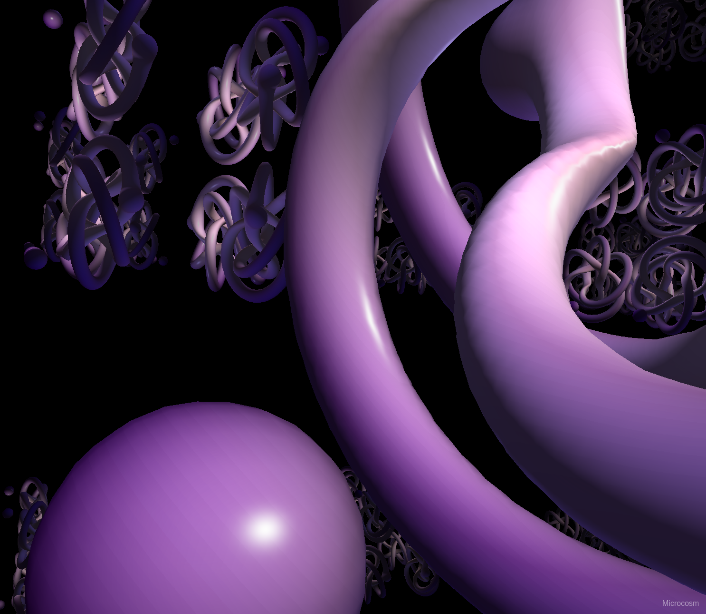

# Microcosm

[Live Demo](http://art.muth.org)

## Features:

* GPL 3 Licensed
* Implemented in [Dart](https://www.dartlang.org)
* With the [ChronosGL Engine](https://github.com/ChronosTeam/ChronosGL)
* Using (Cube Marching Look-up Tables)[http://transvoxel.org/) by (Eric Lengyel)[http://www.terathon.com/lengyel/]
* Code at [https://github.com/robertmuth/Microcosm]

## About

This is a re-implementation of [Terence M. Welsh's](http://www.reallyslick.com)
awesome (Microcosm Screensaver)[http://www.reallyslick.com/screensavers/].

At the heart of the screensaver are animated iso surfaces represented by
signed distance functions (SDFs).

We use cube marching to extract a triangle mesh which is then rendered using traditional
shaders. Great care is taken to evaluate the SDF for as few points as possible.

The screensaver works best when the <i>detail</i> level is set to 12.5 or
lower which requires a higher-end system for acceptable frame rates.
It also works much better in Firefox than Chrome.

## Future Work

Currently, the screensaver is limited by the JavaScript performance of the system.
It would be interesting to see if WebWorkers can help speed things up.

It would also be interesting to re-implement the screensaver as a fragment shader
using ray marching techniques.

